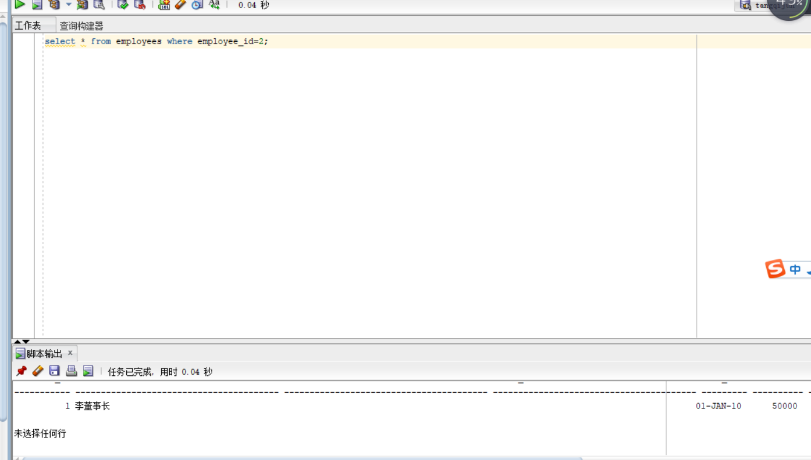
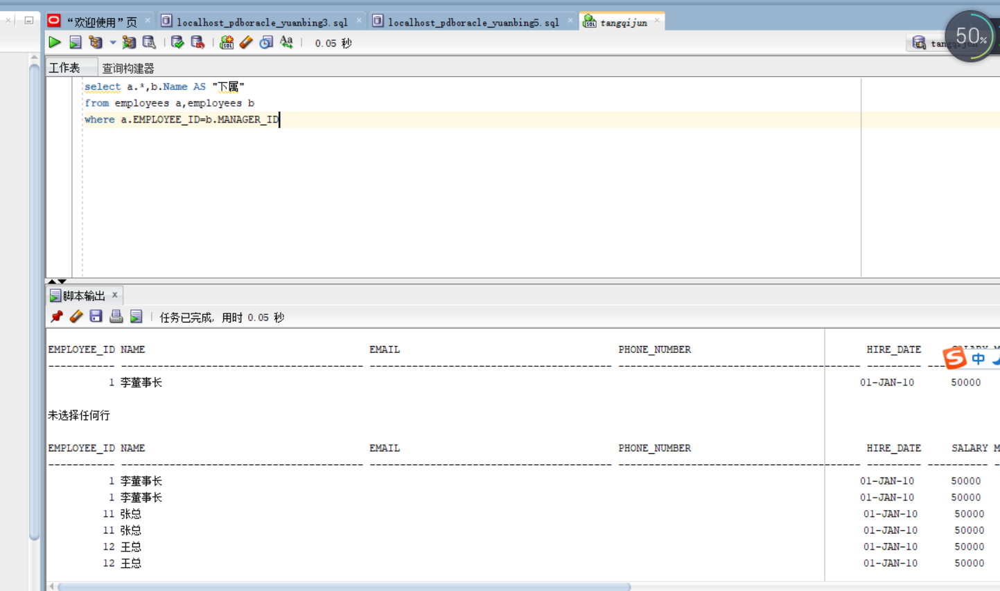
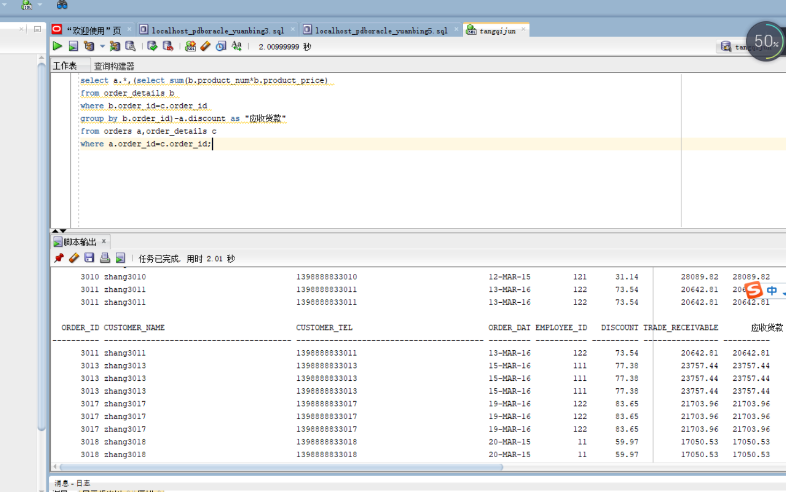
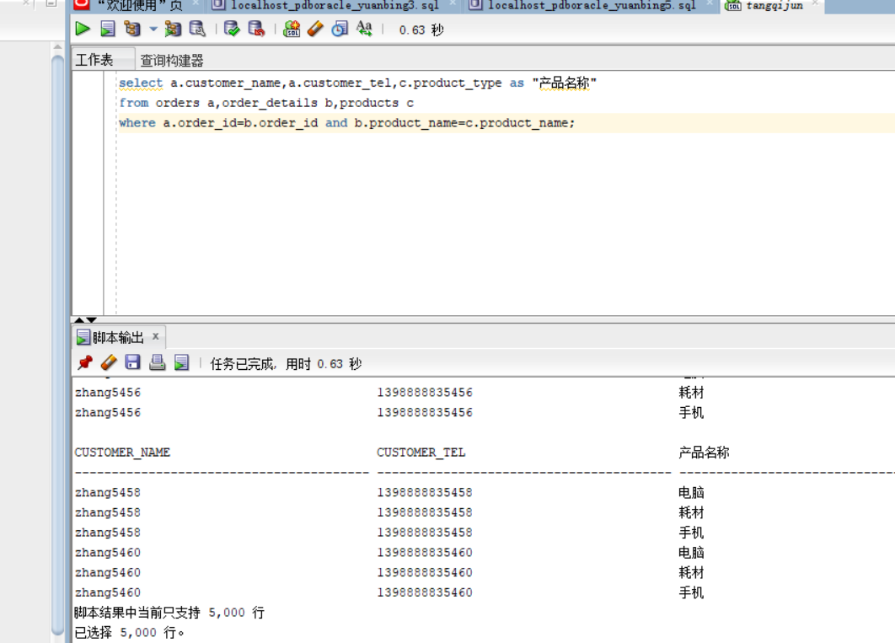
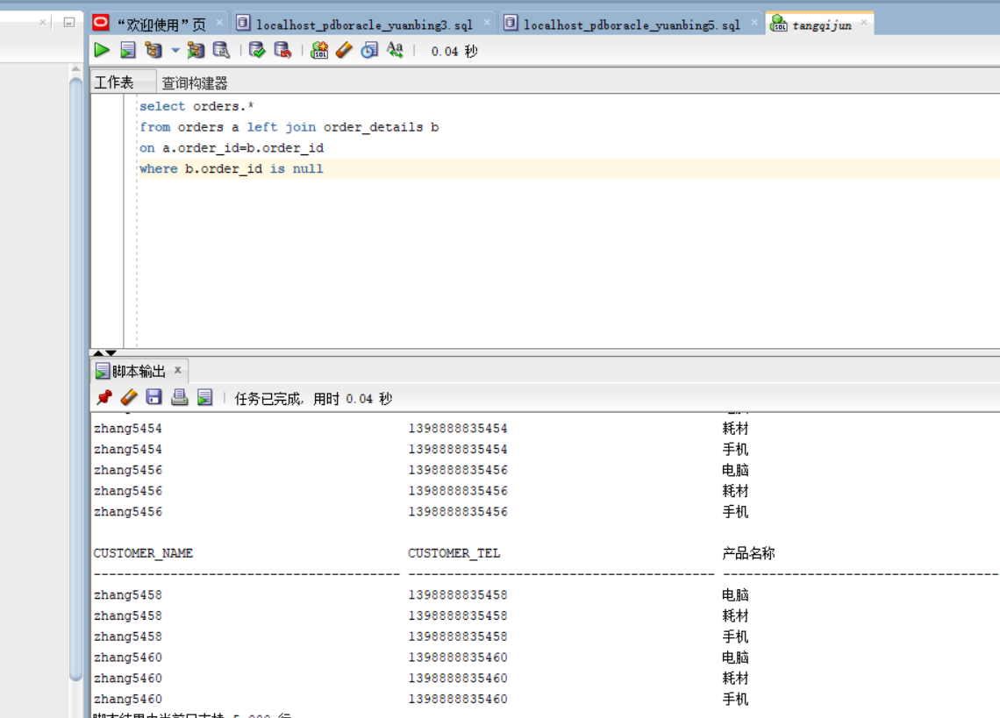
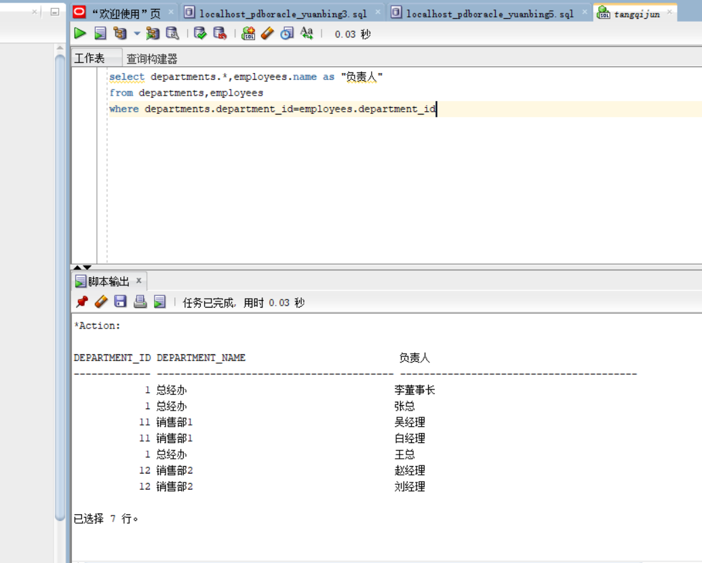
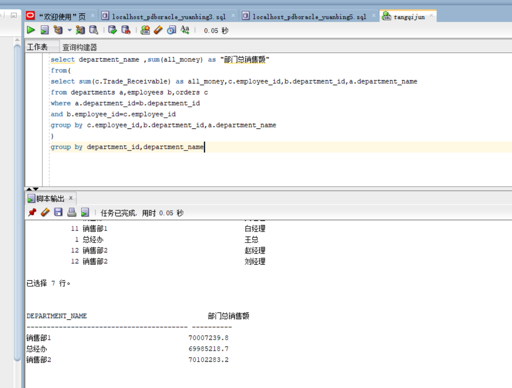

# 实验4：对象管理
- ## *1查询某个员工的信息*: 
```aidl
select * from employees where employee_id=1;
```  
  
- ## **2递归查询某个员工及其所有下属，子下属员工**  
```aidl
select a.*,b.Name AS "下属"
from employees a,employees b
where a.EMPLOYEE_ID=b.MANAGER_ID
```  
  


- ## *3*查询订单表，并且包括订单的订单应收货款: Trade_Receivable= sum(订单详单表.ProductNum*订单详单表.ProductPrice)- Discount。**   

```aidl
select a.*,(select sum(b.product_num*b.product_price)
from order_details b
where b.order_id=c.order_id
group by b.order_id)-a.discount as "应收货款"
from orders a,order_details c
where a.order_id=c.order_id;
```
  
- ## **4查询订单详表，要求显示订单的客户名称和客户电话，产品类型用汉字描述。**    
```aidl
select a.customer_name,a.customer_tel,c.product_type as "产品名称"
from orders a,order_details b,products c
where a.order_id=b.order_id and b.product_name=c.product_name;
```  
  

- ## **5查询出所有空订单，即没有订单详单的订单。**  
```aidl
select orders.*
from orders a left join order_details b
on a.order_id=b.order_id
where b.order_id is null
```
   
- ## **6查询部门表，同时显示部门的负责人姓名**  
```aidl
select departments.*,employees.name as "负责人"
from departments,employees
where departments.department_id=employees.department_id
```  
  

- ## **7查询部门表，统计每个部门的销售总金额。**  
```aidl
select department_name ,sum(all_money) as "部门总销售额"
from(
select sum(c.Trade_Receivable) as all_money,c.employee_id,b.department_id,a.department_name
from departments a,employees b,orders c 
where a.department_id=b.department_id
and b.employee_id=c.employee_id
group by c.employee_id,b.department_id,a.department_name
)
group by department_id,department_name
```  
  
